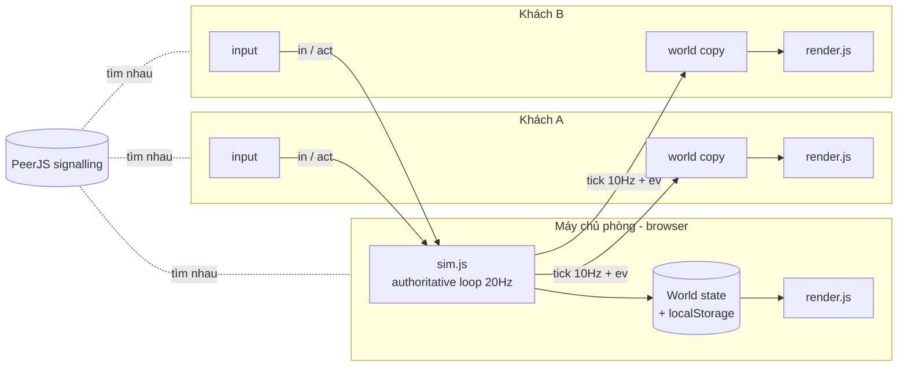

# Nhà Mới Của Chúng Ta (Our New Home) — Game Design & Architecture

> "Chúng ta đến đây cùng nhau, và chúng ta đang xây dựng ngôi nhà của mình."

## 1. Game Vision

Một gia đình 2–4 người cùng đặt chân lên một vùng đất hoang (rừng, đồng cỏ, sông, bãi biển)
và cùng nhau biến nó thành nhà. Không có kẻ thù, không PvP, không thua. Chỉ có:

**Khám phá → Thu thập → Xây dựng → Hợp tác → Phát triển → Mở rộng**

Thế giới phải *thay đổi trực quan* theo tay người chơi: cây đổ thành gốc, nền nhà mọc thành
tường rồi thành mái, hạt giống nảy mầm rồi chín vàng. Mỗi lần mở lại, gia đình thấy
"đây là thứ chúng ta đã xây".

Tên chính thức: **Nhà Mới Của Chúng Ta** (giữ "Our New Home" làm tên tiếng Anh).

## 2. Core Gameplay Loop

```
đi lại trong thế giới
   ↓
nhìn thấy thứ cần (cây, đá, cỏ, nước)
   ↓
thu thập (1 nút hành động theo ngữ cảnh)
   ↓
chọn công trình → đặt nền → cả nhà GÓP vật liệu vào nền
   ↓
công trình hoàn thành, mở khoá thứ mới
   ↓
(ruộng) trồng → tưới → chờ → thu hoạch → ăn
```

Vòng lặp nhỏ (30 giây): đi → nhặt → thấy số tăng → mang về góp.
Vòng lặp lớn (15–30 phút): dựng lửa trại → kho → nhà → ruộng → 🎉 "Ngôi nhà đầu tiên".

## 3. Player Experience

- **Hiểu trong 1–2 phút**: 5 bước hiện ở góc màn hình, tự tick khi cả nhà làm được.
- **Một nút hành động**: nút ✋ đổi nhãn theo ngữ cảnh ("Chặt cây", "Lấy nước", "Góp vật liệu",
  "Trồng", "Tưới", "Thu hoạch"). Trẻ em không cần nhớ phím.
- **Không bị phạt**: chỉ có thanh *sức* (energy) giảm khi làm việc, hết sức thì làm chậm hơn,
  ăn/uống là hồi. Không chết, không mất đồ.
- **Không bắt phải online**: ai online lúc nào cũng làm được việc; đồ của người offline vẫn giữ.
- **Thấy nhau**: tên và avatar trên đầu, emote 👋❤️😄, chat ngắn, hiển thị "Mẹ đã góp 10 gỗ".
- Vai trò mềm: không class. Người lớn thường chặt/đập, trẻ hái dâu, nhặt vỏ sò, tưới cây,
  tìm lúa hoang (nguồn hạt giống duy nhất → đóng góp thật cho progression).

## 4. World Design

Map MVP 48 × 36 ô (ô = 48px), sinh từ seed, cố định cho mỗi thế giới:

```
 ░░░░░░░ RỪNG 🌲🌲🌲 (gỗ, dâu) ░░░░░░░      y 0–9
 🌾 lúa hoang  |  ĐỒNG CỎ  | 🌳 táo, 🪨 đá   y 10–21   ← điểm bắt đầu giữa đồng
 ~~~~~~~~ SÔNG 💧 ~~~ bãi cạn ~~~~~~~~~~      y 22–24   ← lội qua ở giữa
 🏖️ BÃI BIỂN 🐚 vỏ sò, 🪵 gỗ trôi            y 25–35
```

Tài nguyên (node) có HP, cạn thì mọc lại sau 1–2 phút. Cây chặt xong thành gốc và *đi xuyên
được* → phá rừng mở đường là một cảm giác tiến bộ trực quan.

Camera: **top-down 2D**, canvas, theo người chơi. Chọn top-down vì: dễ nhất để làm va chạm,
đặt công trình theo ô, chạm/joystick trên mobile, và vẽ bằng emoji + hình đơn giản vẫn đẹp
kiểu storybook. Isometric đẹp hơn nhưng tốn gấp 3 công vẽ và xử lý depth.

## 5. Cooperation Design

- **Công trình = nền chung**: ai cũng đặt nền được; nền hiện "cần 24 gỗ · 12 đá · 8 sợi".
  Bất kỳ ai đi tới bấm "Góp" là trút đồ đang mang vào. Tiến độ 0→33→66→100% đổi hình
  nền → tường → mái. Đây là cơ chế hợp tác cốt lõi: chia nhau đi gom, cùng về góp.
- **Kho chung**: cất đồ vào, người khác lấy ra. Cho phép "để sẵn cho người sau".
- **Tặng trực tiếp**: đứng gần nhau → tặng đồ.
- **Ruộng chia việc**: một người trồng, một người xách nước, một người thu hoạch.
- **Đóng góp gia đình**: đếm tổng vật liệu mỗi người đã góp, hiện tim ❤️, không có bảng xếp hạng.
- Giai đoạn sau MVP: sự kiện bão/lũ cả nhà cùng chuẩn bị, NPC đến định cư, mùa.

## 6. Progression

Progression theo *khu định cư*, không theo level nhân vật.

| Cấp | Tên | Mở khoá |
|---|---|---|
| 1 | Trại | Lửa trại, Kho chung |
| 2 | Nhà đầu tiên | Ngôi nhà nhỏ (cần lửa trại), Ruộng |
| 3 | Trang trại | Giếng nước (cần nhà), nhà lớn, chuồng gà *(sau MVP)* |
| 4 | Làng | Đường, cầu qua sông, NPC *(sau MVP)* |
| 5 | Thị trấn | Chợ, trường, trạm xá *(sau MVP)* |

Tài nguyên MVP: Gỗ, Đá, Sợi, Thức ăn, Nước, Hạt giống. Mở rộng sau: Đất sét, Sắt, Than, Thuốc.

## 7. MVP Scope

- 2–4 người/thế giới, map nhỏ cố định, 8 loại node tài nguyên.
- Hành động: đi, thu thập, lấy nước, ăn, uống, đặt nền, góp, trồng, tưới, thu hoạch,
  cất/lấy kho, tặng, emote, chat.
- Công trình: Lửa trại, Kho chung, Ngôi nhà nhỏ, Ruộng, Giếng.
- Mục tiêu: nhà + ruộng có cây → 🎉 "Ngôi nhà đầu tiên của chúng ta!" cho tất cả.
- Lưu thế giới trên máy chủ phòng, mở lại là tiếp tục với link mời *cũ*.
- Guest rớt mạng vào lại giữ nguyên nhân vật.

## 8. Technical Architecture

Theo kiểu Cờ Caro / Xì Tố trong repo này: **không backend**, game là trang tĩnh, kết nối
WebRTC qua PeerJS (server công cộng chỉ để hai bên tìm nhau). Java/Postgres/Redis trong
prompt gốc bị bỏ: với 2–4 người và chơi theo gia đình, một máy làm chủ phòng là đủ, và
repo đang deploy tĩnh.



- **Authoritative host**: khách chỉ gửi `in {mx,my}` (hướng đi) và `act {a:'gather', id}`.
  Chủ phòng kiểm tra khoảng cách, node còn HP, cooldown, sức chứa túi, rồi mới đổi state.
- **Game loop**: host `setInterval 50ms` → di chuyển, hồi sức, mọc lại, cây lớn → gom sự kiện.
  Gửi `tick` 10Hz (vị trí/túi của mọi người) và `ev[]` (thay đổi thế giới) theo batch.
- **Client prediction**: khách tự di chuyển nhân vật của mình bằng cùng hàm `moveEntity`,
  nhận tick thì kéo nhẹ về vị trí host (snap nếu lệch > 1 ô). Người khác được nội suy.
- **Persistence**: host lưu JSON thế giới vào `localStorage` mỗi 5s + khi đóng tab.
  Mã phòng = mã thế giới → link mời không đổi giữa các buổi chơi.
- **Reconnect**: `cid` của mỗi người lưu trong localStorage; vào lại cùng link → host gắn lại
  đúng nhân vật, đồ đạc, vị trí.
- **Solo**: chơi một mình = host không có khách; bấm "Mời" bất kỳ lúc nào.

Cấu trúc code (`newhome/`), ES modules, không framework:

```
index.html        màn hình, HUD, sheets
css/style.css
js/config.js      hằng số: tài nguyên, node, công trình, cây trồng, nhiệm vụ
js/world.js       sinh map từ seed, occupancy grid
js/sim.js         luật game (host) + moveEntity dùng chung
js/net.js         PeerJS host/guest, retry, reconnect
js/render.js      canvas top-down, camera, fx
js/input.js       bàn phím + joystick cảm ứng
js/ui.js          HUD, sheets, toast, celebrate
js/main.js        luồng màn hình, nối mọi thứ, lưu/tải
```

## 9. Database Design (localStorage trên host)

```
newhome.profile          {name, avatar}
newhome.cid              id người chơi cố định của máy này
newhome.worlds           ["abc123", ...]
newhome.world.<code>     {
  code, seed, savedAt, createdAt,
  W: { t, nextId, nodes{id→{id,k,tx,ty,hp,re}}, sites{id→{...}}, bld{id→{...,plots[]}},
       store{res→n}, flags{wood,stone,fire,house,plant,celebrated}, contrib{pid→n} },
  players: { pid → {pid,cid,name,avatar,color,x,y,e,inv{...}} }
}
```

Nếu sau này cần server thật (nhiều gia đình, cross-device save) thì snapshot này map 1:1
sang bảng `worlds(code, json)`, không cần đổi client.

## 10. WebSocket Protocol (ở đây là PeerJS DataConnection, reliable)

Khách → Chủ:

| msg | nội dung |
|---|---|
| `hello` | `{cid, name, avatar}` |
| `in` | `{mx, my}` hướng đi −1..1, gửi khi đổi hoặc mỗi 400ms |
| `act` | `{a:'gather',id}` · `{a:'water'}` · `{a:'eat'}` · `{a:'drink'}` · `{a:'place',kind,tx,ty}` · `{a:'contribute',id}` · `{a:'plant',id,i}` · `{a:'waterPlot',id,i}` · `{a:'harvest',id,i}` · `{a:'stash',res,n,dir}` · `{a:'give',pid,res,n}` · `{a:'emote',e}` · `{a:'chat',text}` |
| `bye` | rời phòng |

Chủ → Khách:

| msg | nội dung |
|---|---|
| `welcome` | `{pid, W, players}` snapshot đầy đủ |
| `roster` | `{players}` meta mọi người (tên, avatar, online) |
| `tick` | `{wt, ps:{pid:[x,y,e,wk,inv[6]]}}` 10Hz |
| `ev` | `{evs:[...]}` — `node`, `site`, `siteDone`, `bld`, `plot`, `store`, `flags`, `contrib`, `fx`, `toast`, `emote`, `chat`, `celebrate` |
| `full` / `bye` | phòng đủ 4 người / chủ đóng phòng |

## 11. Development Milestones

| # | Milestone | Kết quả chạy được |
|---|---|---|
| 1 | Di chuyển solo | Map vẽ ra, một nhân vật đi được bằng phím/joystick, va chạm cây/sông |
| 2 | Multiplayer | Tạo phòng, mở link ở tab 2, hai nhân vật nhìn thấy nhau realtime |
| 3 | Tài nguyên | Chặt cây/đập đá, node đổi hình, mọc lại, mọi người thấy |
| 4 | Túi đồ | Thanh túi, sức, ăn/uống, lấy nước ở sông |
| 5 | Xây dựng | Menu xây, đặt nền, góp, nền→tường→mái, kho chung, tặng |
| 6 | Ruộng | Trồng/tưới/lớn/thu hoạch |
| 7 | Lưu | Host lưu localStorage, màn "Tiếp tục", link mời cũ còn dùng |
| 8 | Vào lại | Khách rớt mạng vào lại giữ nhân vật; host tắt → khách thấy thông báo |
| 9 | Polish | Nhiệm vụ 5 bước, 🎉 celebrate, emote/chat, fx, âm thanh |
| 10 | Deploy | Thêm card vào `index.html`, test iPad + điện thoại |

Milestones 1–9 nằm trong bản MVP đầu tiên này (một lần build, kiểm tra bằng 2 tab).

## 12. Trạng thái bản MVP (01/10/2026)

Đã chạy và kiểm tra bằng hai tab Chrome (host `127.0.0.1`, khách `localhost` để có `cid` khác):

- Tạo thế giới, lưu/tiếp tục, link mời cố định theo mã thế giới.
- Khách vào phòng, hai bên thấy nhau; khách rớt (host reload) → "Mất kết nối → Vào lại" giữ đúng nhân vật.
- Di chuyển, chặt cây (cây cạn, hẹn giờ mọc lại), túi đồ, sức, nhiệm vụ tick theo flags.
- Đặt nền → góp → lửa trại, nhà, kho, ruộng; trồng → tưới → 3 giai đoạn → thu hoạch.
- 🎉 "Ngôi nhà đầu tiên của chúng ta!" hiện ở cả host và khách; kho chung, tặng đồ, emote, chat đồng bộ.

Cập nhật sau MVP:

- Nhân vật người vẽ vector (`js/char.js`): 8 kiểu (bố, mẹ, con gái, con trai, ông, bà, cô/chú, em bé) với tóc,
  váy/quần, râu; tay chân vung theo quãng đường đi, quay mặt 4 hướng, tay vung rìu khi làm việc.
  Dùng chung cho thế giới, ô chọn nhân vật và chip HUD.
- Click/chạm để đi: chạm đất → đi tới (vòng sáng đánh dấu); chạm cây/đá/nền/ruộng/sông → đi tới rồi
  tự làm hành động ngữ cảnh. Phím/joystick luôn ưu tiên và huỷ điểm đến. Bị cản 700ms thì dừng.
  Với host, hướng đi tính trong host loop (Worker, 20Hz) để tab ẩn không làm đi quá đích.

Giới hạn đã biết / việc tiếp theo:

- **Host là một tab trình duyệt.** Host loop chạy bằng Worker timer nên tab ở nền vẫn giữ nhịp,
  nhưng nếu host tắt tab/khoá máy thì khách bị ngắt (có màn hình chờ vào lại). Giải pháp dài hạn
  nếu cần: server thật nhận cùng protocol này.
- **Hai tab cùng máy, cùng origin** dùng chung `newhome.cid` → khách sẽ "nhận lại" nhân vật của host.
  Khi test trên một máy hãy dùng hai origin (`localhost` / `127.0.0.1`) hoặc hai trình duyệt.
- PeerJS public signalling: đôi khi mạng chặn kết nối trực tiếp; có thông báo hướng dẫn đổi wifi/4G.
- Chưa có âm thanh, chưa test thật trên iPad/điện thoại (layout đã làm responsive và có joystick).
- Milestone kế: âm thanh + hiệu ứng; sự kiện bão/mưa; động vật (gà, thỏ); nhà lớn; cầu qua sông;
  NPC đầu tiên đến định cư.
